# SW2MuJoCo 3.2 使用指南

本指南按完整操作顺序介绍如何把 SolidWorks 装配配置为机器人，设置碰撞、传感器、执行器和闭链约束，再导出 URDF 或 MJCF。示例采用 balance2026_gimbal 云台，从未配置的装配副本开始，完成五个 link、四个关节、四个碰撞长方体、IMU、两个电机和一个 connect。

## 1 安装与入口

保存工作并关闭 SolidWorks，运行 `SW2MuJoCo_3.2_SW2025_x64_Setup.exe`。升级可以直接安装，不必先卸载。重新打开 SolidWorks，在加载项中启用 SW2MuJoCo。

MJCF 导出与预览需要本地 Python 和 MuJoCo。在导出窗口填写已安装依赖的 `python.exe`，本机示例为 `D:\Softwaves\python\python.exe`。减面工具可选择 fast-simplification、PyMeshLab 或 Blender；前两者需要对应 Python 包，Blender 需要本地 `blender.exe`。按需选择一种。

先另存装配副本，检查零件引用完整。所有功能在 **工具 → SW2MuJoCo** 下：

| 入口 | 用途 |
|---|---|
| URDF 配置 | 建立 link 树，分配零件，指定关节坐标系和轴 |
| 碰撞配置 | 简单碰撞体及允许碰撞的 link 对 |
| 仿真配置 | site、传感器、执行器、求解设置、两点作用力 |
| 约束配置 | connect、weld、joint 闭链约束 |
| 关节配置 | 阻尼、摩擦、附加惯量、限位、关节弹簧 |
| 导出与预览 | URDF、工程 MJCF、本地 URDF 转 MJCF、已有 MJCF 预览 |

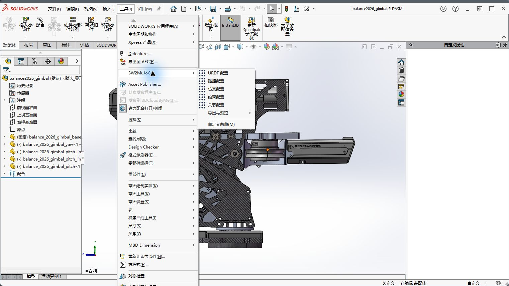

推荐顺序是：参考几何 → URDF 树 → 碰撞 → site → 传感器与执行器 → 约束 → 关节参数 → 导出。只需要 URDF 时，完成 URDF 配置即可。

左侧面板可以拖宽。长页面沿内容区域滚动；滚轮不切换下拉框选项。专属字段只随当前类型或标定方式出现。

## 2 准备参考几何

用 SolidWorks 的参考几何体功能创建坐标系、轴和点。优先引用对应零件的顶点、边、面或关联草图，使参考随零件移动。装配中仅按固定坐标画出的点，不会自动跟随零件移动。

坐标系先选择原点，再用边、轴或草图线指定方向并检查正负；参考轴可由圆柱面、两点或两平面建立；参考点可使用顶点、草图点或参考点特征。

本例用 origin_coord 作为根原点，yaw_coord、pitch_coord、pitch0_coord、pitch1_coord 作为子 link 原点；各关节使用同名前缀的 shaft 轴。imu_coord 为 IMU 安装坐标系，pitch_cnct_point 和 pitch1_cnct_point 为闭链连接点。碰撞角点另建四个坐标系。

移动零件后先重建，必要时按 `Ctrl+Q` 完整重建。参考仍不更新时，检查外部引用、压缩状态与关联关系。

## 3 配置 URDF 树

进入 **URDF 配置**，设置根 link 名称，选择全局原点坐标系，并选取根包含的零件。逐个建立子 link，在树中选中条目，设置所属零件、父子关系、joint 坐标系与轴。

一个 link 表示一个刚体，可包含多个共同运动的零件。不同运动部件不能放进同一个 link。URDF 树不能闭环；额外的闭链连接在约束配置中完成。

本例树结构如下：

```text
base
└── yaw
    ├── pitch
    └── pitch0
        └── pitch1
```

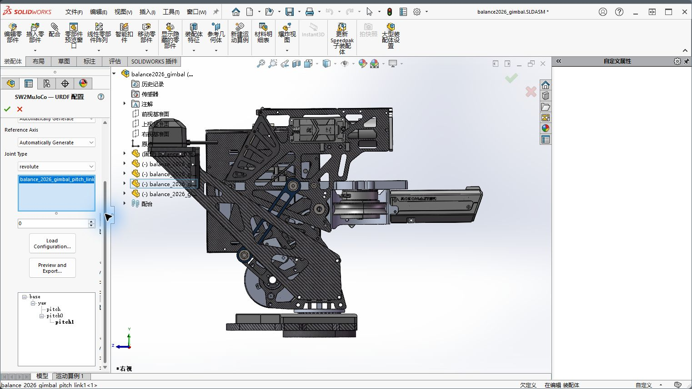

选中子 link，指定原点坐标系与轴，检查方向。它们决定关节位置、运动轴和正负方向。

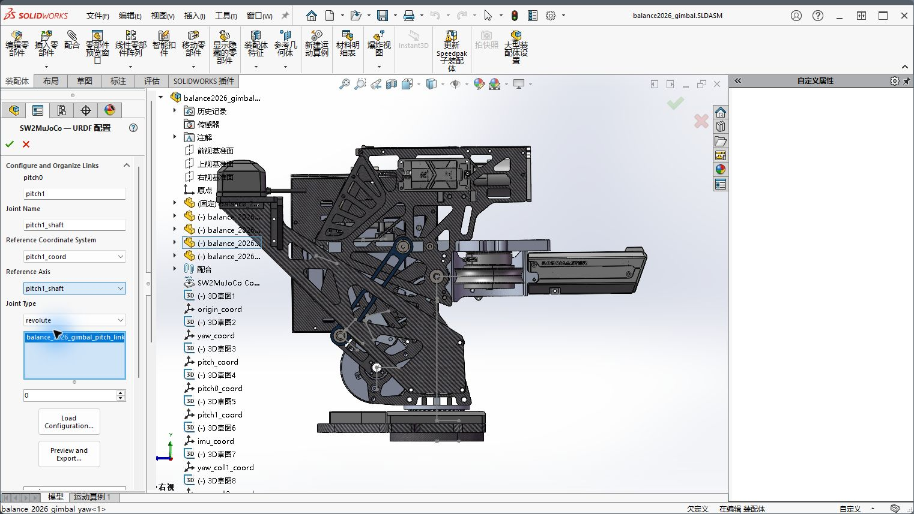

点击 **Preview and Export...** 进入原属性向导。fixed 是固定关节，continuous 是无角度限位的转动关节，revolute 是有限位的转动关节，prismatic 是移动关节。有限位关节填写有效的上下限；转动用 rad，移动用 m。空白上下限不表示无限制。

本例 yaw 使用 continuous，其余三个使用 revolute。行程必须按实际机构填写，演示值不代表机械安全范围。Link 属性页可以检查质量、质心、惯量与外观；先确认零件材质和质量属性正确。

## 4 碰撞几何体

进入 **碰撞配置 → 几何体**，选所属 link。列表随 link 切换。碰撞模式可选原始网格、简单几何体或无碰撞。简单碰撞体不代替模型外观。

点击添加，命名，选 box、sphere、cylinder 或 capsule，再选标定方式。点击显示的拾取按钮，随后在模型或特征树中选参考。尺寸用 **mm**，角度用 **度**。

### 长方体

“中心坐标系 + 尺寸”以坐标系原点为中心，长宽高沿 X、Y、Z 对称延伸。坐标系在预览中间是正常的。

从角点起算时选 **角点坐标系 + 尺寸**，拾取角点坐标系，分别填长 X、宽 Y、高 Z，再选择各轴正向或负向延伸。尺寸旁可拾取直边，用其长度驱动对应尺寸。长宽高分别配置；恢复手动输入时清除尺寸引用。

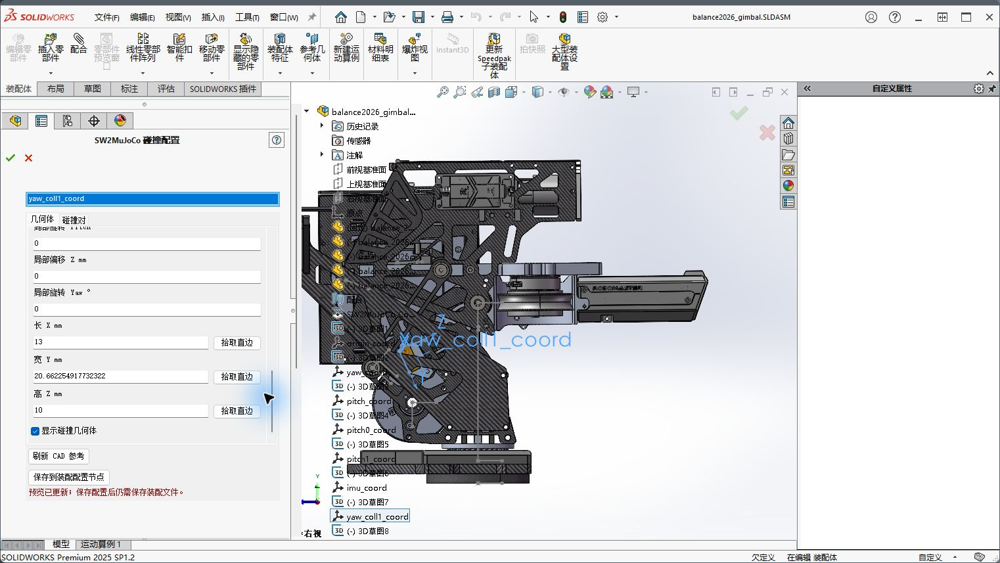

本例四个 box 均使用角点坐标系方式，尺寸如下。拾取对应坐标系后，检查预览中延伸方向是否覆盖目标碰撞区域。

| 所属 link | 名称 | 坐标系 | X / Y / Z 尺寸（mm） |
|---|---|---|---|
| yaw | yaw_limit_1 | yaw_coll1_coord | 13 / 20.6623 / 10 |
| yaw | yaw_limit_2 | yaw_coll2_coord | 11.4632 / 13 / 10 |
| pitch0 | pitch0_limit | pitch0_coll_coord | 37.1818 / 5 / 17 |
| pitch | pitch_limit | pitch_coll_coord | 117 / 6 / 24 |

“矩形面 + 厚度”需选择实际矩形平面面，填写厚度和拉伸方向。可在草图画矩形，再创建平面曲面；基准面或仅四条草图线不等于矩形面。

### 球 圆柱和胶囊

| 形状 | 可选标定方式 | 尺寸 |
|---|---|---|
| 球 | 中心点、坐标系、球心与球面一点、球面、手动 | 半径 |
| 圆柱 | 中心坐标系、两端面中心点、端面圆心坐标系与拉伸轴、圆柱面与范围点、手动 | 半径与高度 |
| 胶囊 | 中心坐标系、两端球心、坐标系与总长度、手动 | 半径；圆柱段长度或总长度 |

圆柱端面方式以坐标系原点为一端圆心，选择 X、Y 或 Z 拉伸轴及正负方向，再填半径和高度。中心方式以原点为中点，二者不要混用。

胶囊两端点是半球球心，球心距离为圆柱段长度；总长度包括两端半球，应不小于两倍半径。球不需要方向。参考方式可填写局部位姿偏移微调。

打开实时预览检查位置、方向和尺寸。状态区提示参考缺失时，补齐后再导出。

### 允许碰撞的 link 对

切换 **碰撞对** 标签。默认排除内部碰撞时，在这里选择两个 link 并添加，明确允许所需接触。本例允许 pitch0 与 yaw、pitch 与 yaw。

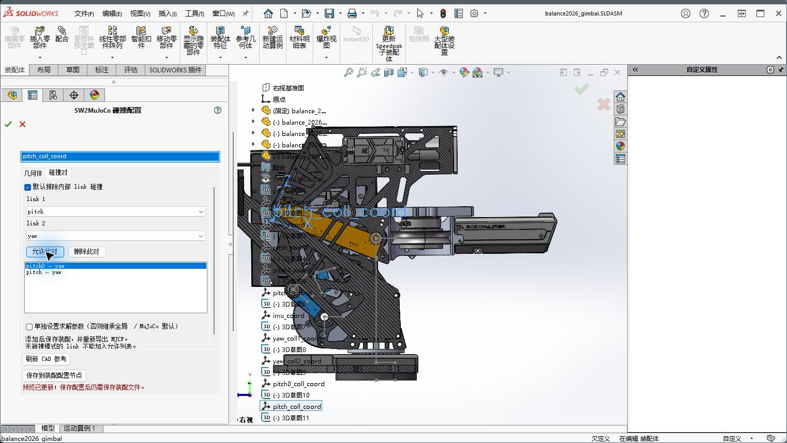

一般继承全局参数；勾选单独设置后才出现局部接触参数。铰接处本来重叠或紧邻的零件不要随意加入碰撞对，以免与闭链约束冲突。

## 5 site 与传感器

进入 **仿真配置 → 附着点**，选所属 link，添加并命名。point 只记录位置；frame 记录位置与方向。点击拾取再选参考。frame 必须选择参考坐标系。

本例 site_imu 属于 pitch，使用 frame 和 imu_coord；site_cnct 属于 pitch，使用 point；site_pitch1 属于 pitch1，使用 point。

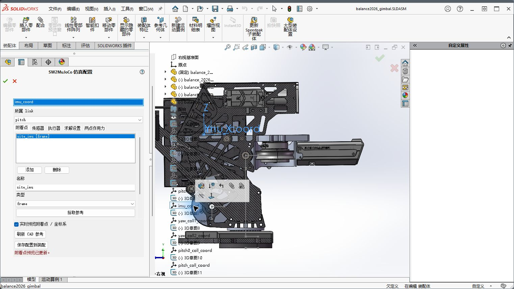

在 **传感器** 页添加 imu，并从已有 frame site 中选择 site_imu。这里选择的是 site，不是直接从特征树选 CAD 坐标系。列表为空时先确认 frame 已建立、已拾取且所属 link 正确。

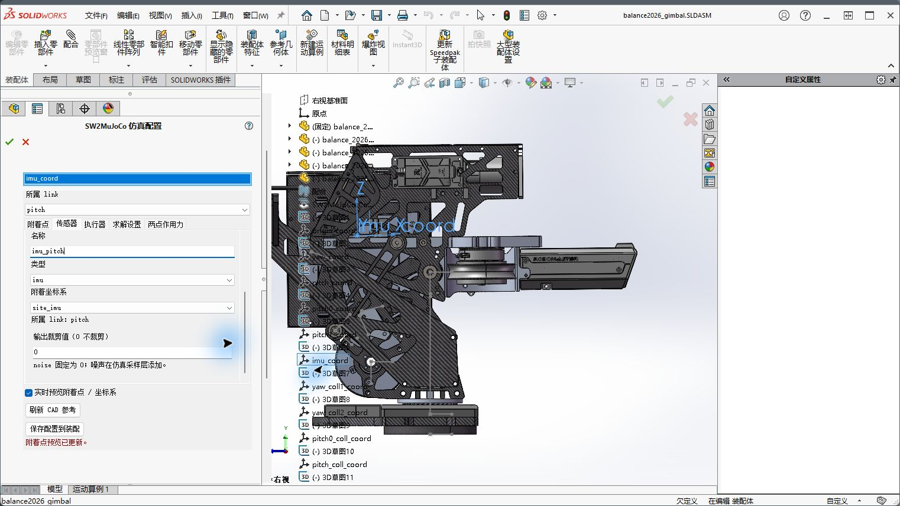

IMU 输出加速度计与陀螺仪。TOF 沿 frame site **+Z** 测距；相机朝 **−Z**，填写垂直视场角 fovy，单位度。cutoff 为输出裁剪值，0 不裁剪。噪声由仿真采样层添加。

改 site 名字在附着点页完成，相关引用同步更新。删除后需修正依赖它的传感器、约束和两点作用力。

## 6 执行器与关节

### 执行器

在 **仿真配置 → 执行器** 选所属 link，添加条目并选择 joint。

| 类型 | 控制含义 | 专属参数 |
|---|---|---|
| motor | 力或力矩输入 | gear |
| position | 目标关节位置 | kp、gear |
| velocity | 目标关节速度 | kv、gear |

转动位置用 rad，速度用 rad/s；移动位置用 m，速度用 m/s。gear 改变控制到关节力或力矩的映射。控制范围限制输入，执行器力范围限制输出，二者不是关节行程限位。

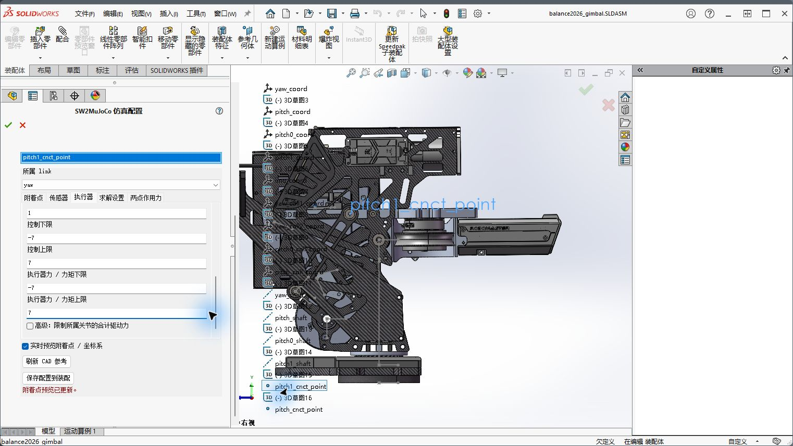

本例 yaw_shaft 的 motor 为 gear 1，输入与输出均为 ±7；pitch0_shaft 为 gear 1，范围 ±2.223。实际按电机和传动参数设置。高级“限制所属关节的合计驱动力”限制同 joint 的所有执行器总输出，启用时填写独立上下限。

### 关节物理参数

进入独立 **关节配置**，选实际 URDF joint。位置和轴向取自 URDF 树，不在此覆盖。类型 inherit 沿用，可覆盖 hinge 或 slide。

阻尼 damping、干摩擦 frictionloss、附加惯量 armature 各自输入，空白沿用，数字明确覆盖。启用执行器感知默认值时，有 actuator 的 joint 使用 0.01、0.01、0.001；其余使用 0.001、0.001、0。手动值优先。

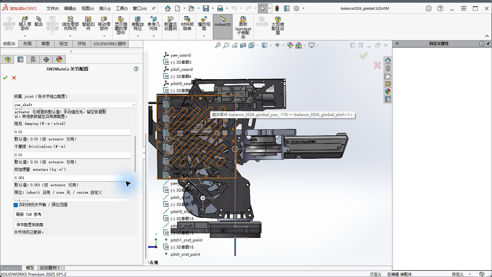

限位可沿用、取消或自定义；自定义填写上下限。关节弹簧可沿用、关闭或自定义，自定义设置刚度与 springref 平衡位置。ref 是关节参考值，与 springref 不同。不同 joint 独立保存。

限位、摩擦求解参数在需要时展开，分别填写时间常数、阻尼比和阻抗参数。默认系数只是调试起点，需按机械性质校准。

## 7 闭链约束

进入 **约束配置**，添加并选类型。直接选择已有 site 或 joint，所属 link 自动推断，无需 CAD 拾取。

| 类型 | 对象 | 作用 |
|---|---|---|
| connect | 两个 point 或 frame site | 约束位置重合，允许相对转动 |
| weld | 两个 frame site | 约束相对位置与方向 |
| joint | 一个或两个 joint | 按多项式约束关节坐标 |

本例 pitch_loop 使用 connect，绑定 site_cnct 与 site_pitch1。先检查 CAD 初始状态下两点是否位于实际连接位置。

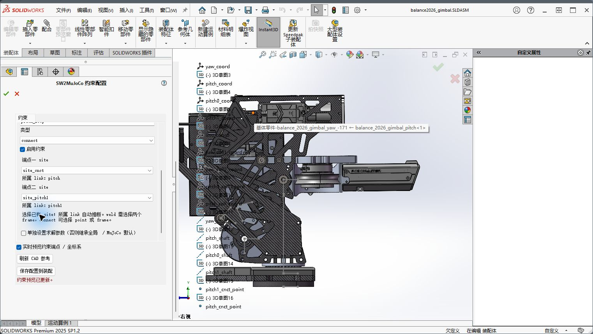

joint 使用 a0 至 a4：`y−y0 = a0 + a1(x−x0) + … + a4(x−x0)^4`。第二 joint 留空只使用 a0。转动用 rad，移动用 m。约束默认继承全局参数，需要时单独覆盖。

## 8 求解设置与两点作用力

在 **仿真配置 → 求解设置** 点击“应用刚性机器人预设”。步长 0.001 s，最大迭代 100，容差 1e−9。闭链时间常数 0.005 s、阻尼比 1；接触时间常数 0.003 s、阻尼比 1，提前接触距离 0.001 m。

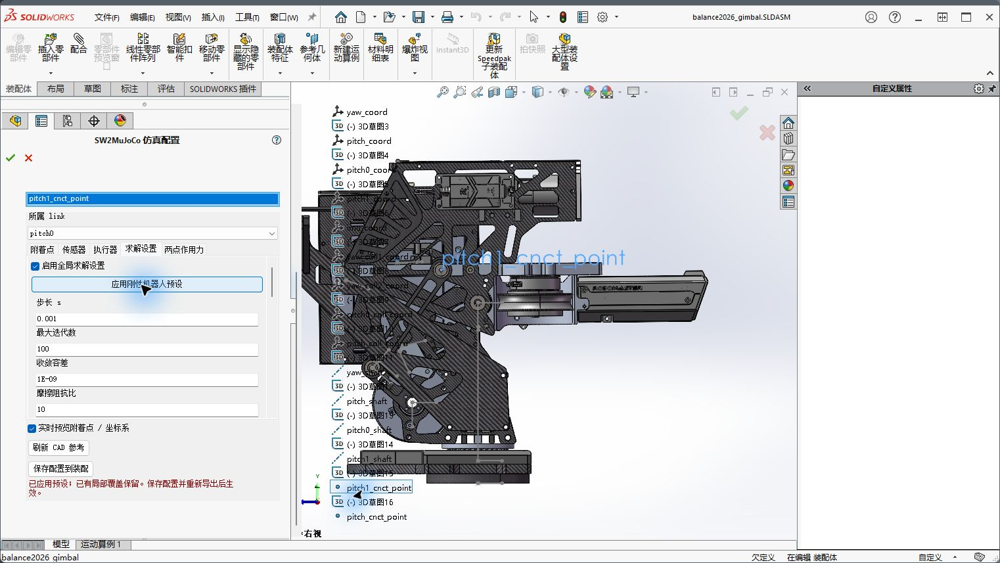

明显抖动或误差时先检查碰撞冲突、闭链点、过约束、惯量与驱动力，再减小步长或调参数。margin 会提前产生接触，不宜盲目加大。

**仿真配置 → 两点作用力** 中选择两个属于不同 link 的 site。pull 为恒拉力，push 为恒推力，输入非负 N 值。作用方向随两点连线变化，偏心位置会产生力矩，两点不能重合。

spring 为双向弹簧，填写刚度 N/m、阻尼 N·s/m。自然长度 initial 使用初始距离，初始弹性力为零；custom 填自定义自然长度，单位 m。伸长时拉回，缩短时推开。默认刚度与阻尼为零，需输入期望值。先用小刚度检查稳定性。

## 9 保存与重用

配置完成点击“保存配置到装配”或页面绿色确认，再 `Ctrl+S` 保存 `.sldasm`。特征树统一显示 **SW2MuJoCo Configuration**，下次打开可继续编辑。

不同 SolidWorks Configuration 独立保存；切换后重新打开配置页面。旧版配置可读取，保存后统一为新节点。另存、替换零件后检查参考有效性，失效时重新拾取。

## 10 导出 URDF

选择 **导出与预览 → 导出 URDF**，进入 Preview and Export，检查 joint，Next 后检查 link。

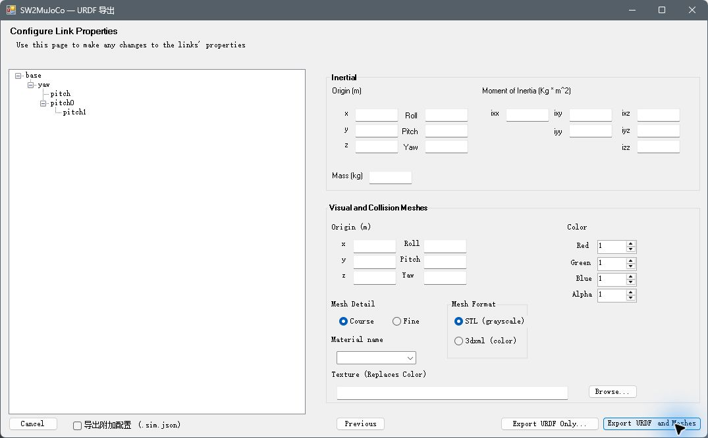

首次选 Export URDF and Meshes；已有配套网格且只更新 URDF 时可选 Export URDF Only。保留原 ROS 包及配套产物，URDF STL 不减面。

不勾“导出附加配置 (.sim.json)”只输出原 URDF 包。需要以后从本地 URDF 导出带仿真扩展的 MJCF 时勾选，得到同名 .sim.json。URDF、网格和附加文件保持配套；修改 URDF 后重新导出附加配置。

## 11 导出 MJCF 与减面

### 从工程导出

选 **从当前工程导出 MJCF**，填写 Python 和 XML 保存位置。无需手动先导出 URDF，装配内配置会一起使用。点击“STL 减面设置”，选择工具与最大面数。示例用 fast-simplification、100000；Blender 方式还要填写 blender.exe。

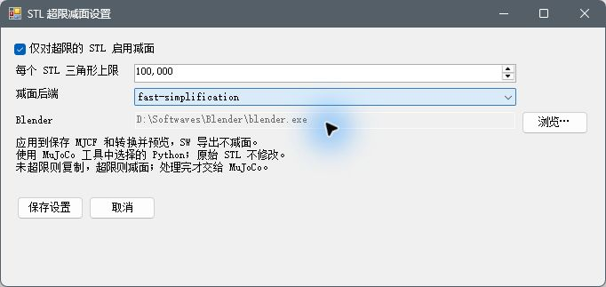

只有超阈值 STL 减面，其余复制。阈值不超过 200000，URDF 原始网格不变。点击“导出 MJCF”仅保存；“导出并预览 MJCF”保存成功后打开 viewer。期间不要编辑装配或切换 Configuration。

最终目录只有 XML 与 meshes：

```text
balance2026_gimbal_mjcf/
├── balance2026_gimbal.xml
└── meshes/
    ├── mesh_0000.stl
    └── ...
```

分享时复制整个目录，不要仅复制 XML。

### 从本地 URDF 导出

选 **从本地 URDF 导出 MJCF**，填 URDF。存在同名 .sim.json 时自动填入，可另选配套文件；留空只转换 URDF，不含工程额外仿真配置。填写输出位置与减面设置后导出，不需要打开对应 SW 工程。

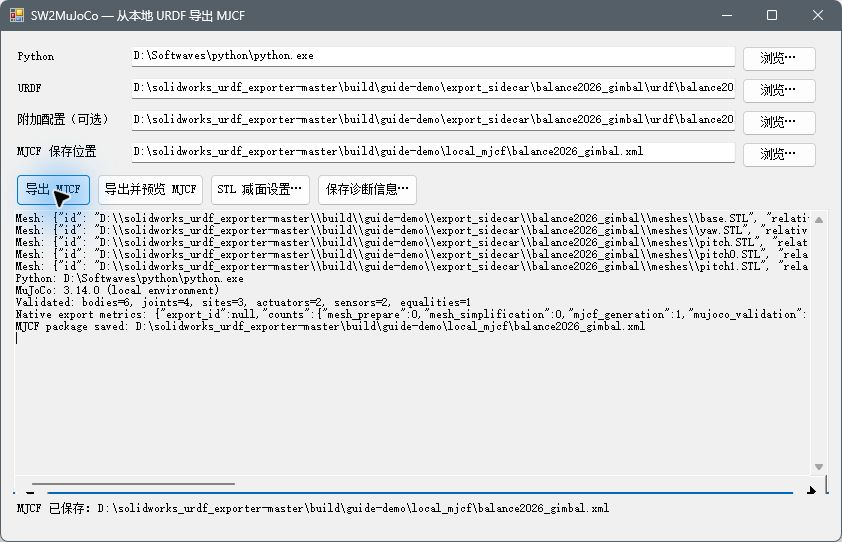

## 12 预览与排错

选择 **预览已有 MJCF**，填写 Python 和 XML 后预览，此入口不修改模型。viewer 左侧 Run 运行、Pause 暂停、Reset 重置；右侧 Control 控制执行器。先用小输入检查方向、行程和响应。关闭 viewer 后导出窗口恢复可操作。需要中止导出或预览时，关闭导出窗口；窗口会等待清理完成后关闭。取消或失败不会替换此前有效的 MJCF 包。

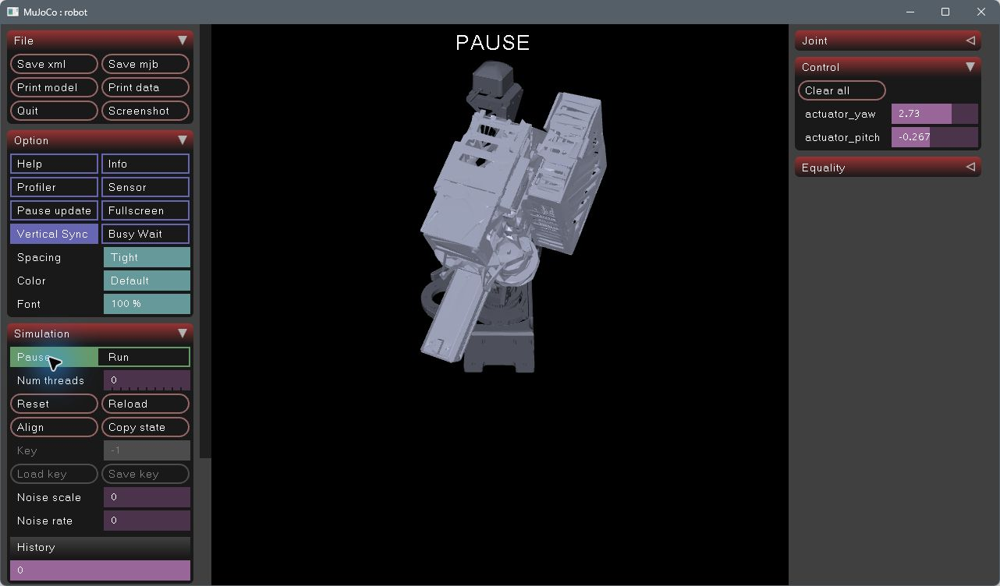

| 问题 | 处理 |
|---|---|
| IMU 列表为空 | 先建立并拾取 frame site，确认所属 link |
| box 坐标系在中间 | 中心方式如此；从角点起算改选角点方式 |
| STL 超出面数限制 | MJCF 导出启用减面，阈值不超过 200000 |
| 关节上下限缺失 | URDF joint 属性页填写；无角度限位转动用 continuous |
| 找不到 Python 或工具 | 检查路径及该 Python 环境依赖 |
| 闭链拉开或抖动 | 检查 site、碰撞冲突、惯量与驱动力，再调整步长 |
| 参考不跟随零件 | 完整重建并检查实际关联关系 |
| 附加文件不匹配 | 同一次重新导出 URDF 与 .sim.json |
| 预览未体现新配置 | 保存配置后重新导出；已有 MJCF 预览只读旧 XML |

导出错误在窗口日志查看，需要保留时点击“保存诊断信息”。先修正明确指出的参考、名称或参数，再重新导出。
